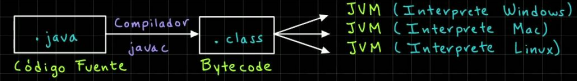
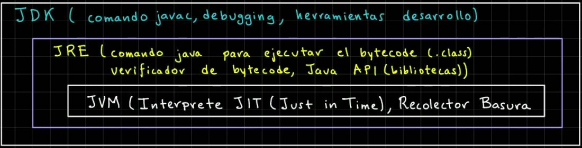

## Java

### Características de Java

1. **Portabilidad y Plataforma Independiente**:

    Una de las mayores fortalezas de Java es su lema **"Escribe una vez, ejecuta en cualquier lugar"** (WORA). Esto significa que el código Java compilado puede ejecutarse en cualquier plataforma que tenga una Máquina Virtual de Java (JVM). Esta portabilidad es crucial en un mundo donde los sistemas operativos y dispositivos son variados.

2. **Seguridad y Rendimiento**:

    Java fue diseñado con la seguridad en mente. Su arquitectura incluye características de seguridad incorporadas que protegen contra una amplia gama de amenazas y vulnerabilidades. Además, la gestión automática de memoria mediante **Garbage Collection** y su **arquitectura multihilo** lo hacen eficiente y rápido.

### ¿Qué es un Compilador y por qué se necesita para trabajar con Java?

Un compilador es una herramienta que traduce el código fuente escrito en un lenguaje de alto nivel (como Java) a un lenguaje de bajo nivel o código máquina que puede ser ejecutado directamente por el sistema operativo de la computadora. Este proceso es crucial porque las computadoras no entienden el código de alto nivel directamente; necesitan instrucciones en un formato que puedan ejecutar.

### ¿Por qué se Necesita un Compilador en Java?

En el caso de Java, el compilador `javac` convierte el **código fuente Java** `.java` en **bytecode** `.class`. El bytecode es un formato intermedio que es independiente de la plataforma y puede ser ejecutado en cualquier sistema operativo que tenga una **Máquina Virtual Java** (JVM).

  

### ¿Qué es el JDK?

El `Java Development Kit` (JDK) es un paquete de herramientas necesarias para desarrollar aplicaciones en Java. Incluye:
1. **Compilador** (`javac`): Traduce el código fuente Java a bytecode.
2. **Java Runtime Environment** (JRE): Proporciona las bibliotecas y la JVM necesarias para ejecutar el bytecode.
3. **Herramientas de Desarrollo**: Incluye herramientas como el depurador (`jdb`), el empaquetador (`jar`), entre otras.

### ¿Qué es el JRE?

El `Java Runtime Environment` (JRE) es un subconjunto del JDK. Es todo lo que necesitas para ejecutar programas Java, pero no para desarrollarlos. Incluye:
1. **Java Virtual Machine** (JVM): Ejecuta el bytecode Java.
2. **Bibliotecas de Clase**: Conjunto de bibliotecas necesarias para ejecutar aplicaciones Java.
3. **Otros Componentes**: Archivos de configuración, bibliotecas nativas, etc.

### Resumen

| Componente | Descripción |
|------------|-------------|
| **Compilador** | Convierte el código fuente Java en bytecode que puede ser ejecutado por la JVM. |
| **JDK** | Incluye el compilador, el JRE, y otras herramientas de desarrollo. |
| **JRE** | Incluye la JVM y las bibliotecas necesarias para ejecutar aplicaciones Java. |
| **JVM** | Ejecuta el bytecode Java y permite la independencia de plataforma. |

  

