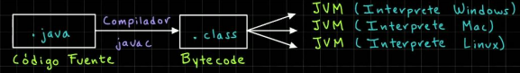
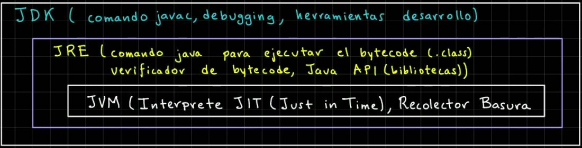

# Aprende Java

## Definición de Java como Lenguaje de Programación

Java es un lenguaje de programación de alto nivel de paradigma Orientado a Objetos ([OOP](https://es.wikipedia.org/wiki/Programaci%C3%B3n_orientada_a_objetos)), [multiplataforma](https://es.wikipedia.org/wiki/Multiplataforma) y [fuertemente tipado](https://es.wikipedia.org/wiki/Tipado_fuerte).

## Introducción a Java

### ¿Por qué Java?¿Qué ofrece?

| Característica   | Descripción                                                                                                                                                                                                                                                                                                                                                                                                                                                                                                                                                                                                                                                                                                                    |
|------------------|--------------------------------------------------------------------------------------------------------------------------------------------------------------------------------------------------------------------------------------------------------------------------------------------------------------------------------------------------------------------------------------------------------------------------------------------------------------------------------------------------------------------------------------------------------------------------------------------------------------------------------------------------------------------------------------------------------------------------------|
| **Portabilidad** | Una de las mayores fortalezas de Java es su lema **"Escribe una vez, ejecuta en cualquier lugar"** (Write Once, Run Anywhere). Esto significa que el código Java compilado puede ejecutarse en cualquier plataforma que tenga una Máquina Virtual de Java (JVM).                                                                                                                                                                                                                                                                                                                                                                                                                                                               |
| **Rendimiento**  | Su arquitectura incluye características de seguridad incorporadas que protegen contra una amplia gama de amenazas y vulnerabilidades. Un detalle no menor es que la gestión de memoria es automática gracias al **[Garbage Collector](https://es.wikipedia.org/wiki/Recolector_de_basura)**, ya que se evitan problemas como fugas de memoria (o [memory leaks](https://es.wikipedia.org/wiki/Fuga_de_memoria)). Además posee una **arquitectura multihilo** brindando la posibilidad de desarrollar aplicaciones que se aprovechen de las ventajas de la multiprogramación y el paralelismo de tareas. Obviamente, para poder aprovechar el paralelísmo y la multiprogramación, se debe diseñar un programa capaz de hacerlo. |

### ¿Qué es un Compilador y por qué se necesita para trabajar con Java?

Un [compilador](https://es.wikipedia.org/wiki/Compilador) es una herramienta que traduce el código fuente escrito en un lenguaje de alto nivel (como Java) a un lenguaje de bajo nivel o código máquina que puede ser ejecutado directamente por el sistema operativo de la computadora. Este proceso es crucial porque las computadoras no entienden el código de alto nivel directamente; necesitan instrucciones en un formato que puedan ejecutar.

Java en sí no se compila directamente a lenguaje máquina como `C` o `C++`, sinó que se compila a **bytecode**, que es un intermedio entre el lenguaje máquina y el **código fuente Java**. El compilador de Java, `javac` (java compliler) convierte el código fuente Java en bytecode (`file.java → file.class`), y el bytecode es ejecutado en cualquier sistema operativo que tenga una **Máquina Virtual Java** (JVM).

<p align="center">
  
</p>

### ¿Qué es el JDK?

El `Java Development Kit` (JDK) es un paquete de herramientas necesarias para desarrollar aplicaciones en Java. Incluye:
1. **Compilador** (`javac`): Traduce el código fuente Java a bytecode.
2. **Java Runtime Environment** (JRE): Proporciona las bibliotecas y la JVM necesarias para ejecutar el bytecode.
3. **Herramientas de Desarrollo**: Incluye herramientas como el depurador (`jdb`), el empaquetador (`jar`), entre otras.

### ¿Qué es el JRE?

El `Java Runtime Environment` (JRE) es un subconjunto del JDK. Es todo lo que necesitas para ejecutar programas Java, pero no para desarrollarlos. Incluye:
1. **Java Virtual Machine** (JVM): Ejecuta el bytecode Java.
2. **Bibliotecas de Clase**: Conjunto de bibliotecas necesarias para ejecutar aplicaciones Java.
3. **Otros Componentes**: Archivos de configuración, bibliotecas nativas, etc.

### Resumen

| Componente     | Descripción                                                                     |
|----------------|---------------------------------------------------------------------------------|
| **Compilador** | Convierte el código fuente Java en bytecode que puede ser ejecutado por la JVM. |
| **JDK**        | Incluye el compilador, el JRE, y otras herramientas de desarrollo.              |
| **JRE**        | Incluye la JVM y las bibliotecas necesarias para ejecutar aplicaciones Java.    |
| **JVM**        | Ejecuta el bytecode Java y permite la independencia de plataforma.              |

<p align="center">
  
</p>


## ¿Cómo empiezo?

Para comenzar a programar en Java, lo primero que vamos a necesitar es **JDK**. Para obtener JDK dispones de dos opciones:
- [JDK](https://www.oracle.com/java/technologies/downloads/) bajo licencia de Oracle.
- [OpenJDK](https://openjdk.org/) bajo la licencia GPL.

La diferencia entre JDK y OpenJDK está principalmente en su origen, licencia y contenido adicional. Ambos son implementaciones de la plataforma Java Development Kit (JDK), necesarias para compilar y ejecutar aplicaciones Java.

Las diferencias generales entre JDK y OpenJDK son las siguientes:

| Característica | **JDK (de Oracle)**                                     | **OpenJDK**                         |
|----------------|---------------------------------------------------------|-------------------------------------|
| **Licencia**   | Licencia comercial (gratuita con límites).              | GPLv2 + Classpath Exception.        |
| **Costo**      | Gratuito para uso personal/pruebas; pago para empresas. | Totalmente gratuito.                |
| **Soporte**    | Soporte oficial de Oracle (para empresas).              | Soporte de la comunidad o terceros. |
| **Extras**     | Herramientas propietarias y optimizaciones.             | Solo herramientas estándar.         |


El cuál elegir dependerá de tus necesidades, si trabajas en un proyecto **personal o de código abierto**, **OpenJDK** es más que suficiente. Por otro lado si necesitas **soporte empresarial** o acceso a las herramientas adicionales de Oracle, considera usar el **JDK de Oracle**, pero ten en cuenta los costos de licenciamiento para entornos comerciales.

### Ya tengo JDK ¿Y ahora?

Bueno pues despues de obtener JDK lo único que necesitas es empezar a escribir código, pero vamos a ir despacio para no complicar todo. Para facilitar el desarrollo suele utilizarse un [IDE](https://es.wikipedia.org/wiki/Entorno_de_desarrollo_integrado) como [IntelliJ IDEA](https://www.jetbrains.com/idea/) de JetBrains, aunque, si este IDE no es de tu agrado, puedes utilizar cualquier IDE o editor de código que te guste.

Algunas de las ventajas de IntelliJ es que proporciona todas las herramientas para desarrollar en Java bien integradas y además, su versión comunitaria es open source! (puedes ver su código fuente [aquí](https://github.com/JetBrains/intellij-community))

Continuando, vamos a escribir y ejecutar nuestro primer programa en Java ignorando algunos detalles que profundizaremos más adelante. Para comenzar vamos a seguir estos pasos:
1. Creamos un archivo que se llamará `HolaMundo.java`
2. Escribiremos un pequeño código que escribirá "Hola Mundo!" en la salida.
3. Compilaremos a **bytecode** el archivo que escribimos.
4. Ejecutaremos nuestro primer programa en Java!

Tu puedes seguir los pasos como te sea cómodo. En esta guía utilizaremos la terminal. A continuación se realizarán los pasos anteriormente listados:

```bash
# Creamos un archivo
touch HolaMundo.java
```
Dentro del archivo escribimos:

```java
public class HolaMundo {
    public static void main(String[] args){
        System.out.println("Hola Mundo!");
    }
}
```

> [!TIP]
> Si haz clonado el repositorio puedes utilizar los archivos que están en la carpeta exercises!

Luego desde la terminal, utilizamos las herramientas de JDK para compilar y ejecutar:

```bash
# Compilamos a bitecode
javac HolaMundo.java

# El comando previo generará un archivo HolaMundo.class
# este archivo es ejecutable por la JVM, así que vamos 
# ejecutarlo
java HolaMundo
```

La salida tras ejecutar el comando `java HolaMundo` debería ser `"Hola Mundo!"`. Si es así felicidades, haz escrito y ejecutado tu primer programa en Java!

## Continuar

Para continuar aprendiendo conceptos de Java, lo mejor es seguir practicando. Si quieres continuar puedes seguir las guias que se listan a continuación en orden, ya que están pensadas para no saltearse pasos al aprender este lenguaje.

1. [Introducción](./guias/introduccion.md)
2. [Gestión de Memoria](./guias/getion_de_memoria.md)
3. [Clases Envolventes](./guias/clases_envolventes.md)