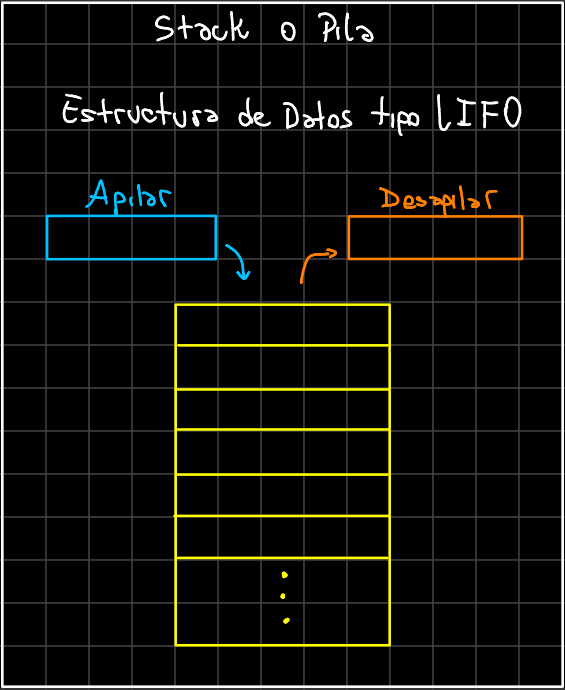

# Gestión de Memoria en Java

En Java, la memoria para la ejecución de un programa se divide principalmente en dos áreas: stack (o Pila) y heap (o Montón). Ambas cumplen roles distintos. 

A continuación vamos a analizar que rol cumple cada una y, en el contexto de la gestión de memoria en Java, cómo se relacionan a bajo nivel con la arquitectura de hardware y los sistemas operativos. Si bien este apartado es importante tenerlo en cuenta, no vamos a profundizar sobre cada parte, ya que sale de lo necesario para aprender Java.

## Stack o Pila

Una [pila](https://es.wikipedia.org/wiki/Pila_(inform%C3%A1tica)) es una estructura de datos lineal, dinámica y de tipo **LIFO** (*último en entrar, primero en salir*). Esto significa que el último elemento insertado en la pila será el primero en ser eliminado o retirado.

<p align="center">
  
</p>

### Rol del Stack en Java y otros lenguajes de programación

El Stack es en donde se almacenan las variables locales, los argumentos de métodos y las direcciones de retorno. Este tipo de espacio en memoria es estático en cuanto a capacidad y contiguo, lo que implica que no hay espacio disponible entre ellos para expandirse o contraerse. En otras palabras, no varía su tamaño a lo largo del tiempo de ejecución y no presenta [fragmentación](https://es.wikipedia.org/wiki/Desfragmentaci%C3%B3n#Fragmentaci%C3%B3n). Todo esto generalmente está determinado por la JVM o el compilador/interprete en otros lenguajes, aunque puede ajustarse.

Por ejemplo, en Java podemos ajustar el tamaño del `stack` dando el parámetro `-Xss<size>m` a la `JVM` de la siguiente manera:

```bash
java -Xss32m MiPrograma
```

En el ejemplo se le han dado 32 MB al Stack. Sin embargo no es habitual modificar estos parametros en la práctica, pero es importante tenerlo en cuenta, ya que en Java cada **hilo** tendrá su propia pila de ejecución.

En términos generales, el **stack** se refiere al área de memoria donde se almacenan los elementos que van a ser utilizados temporalmente durante la ejecución del programa. El stack tiene un límite superior fijo, lo que significa que solo se pueden almacenar un número máximo de elementos.

Por ejemplo cuando una variable es declarada en el ámbito local de un método (es decir, dentro de las llaves `{}`), Java crea un bloque de memoria en la stack para almacenar ese elemento. La dirección de memoria de cada bloque está relacionada con la pila del programa, por lo que se dice que los elementos están "apilados" sobre otros.

Generalidades del **Stack**:
    - **Almacena**: Variables locales y primitivas dentro de métodos.
    - Cada método tiene un **marco (frame)** en el stack para sus variables locales.
    - Se gestiona de forma automática con cada llamada y retorno de métodos (el Garbage Collector **NO** interviene).

### Stack a bajo nivel

La pila no reside en los [registros](https://es.wikipedia.org/wiki/Registro_(hardware)) del procesador, pero está muy estrechamente relacionada con ellos. Se encuentra en el espacio de [memoria virtual](https://es.wikipedia.org/wiki/Memoria_virtual) del proceso (normalmente en la RAM) y se gestiona mediante registros específicos del procesador, uno de ellos es el **Stack Pointer (SP)** que indica la dirección de memoria del tope actual de la pila. Al empujar o retirar datos de la pila, este registro se ajusta automáticamente. Por otro lado existe otro registro llamado Base Pointer (BP) o Frame Pointer (FP) que apunta al inicio del marco del stack de un método (usado en algunas arquitecturas).

Dado que la pila se utiliza para operaciones temporales y llamadas a funciones, los procesadores optimizan el acceso a ella. Las instrucciones para acceder a la pila son directas y muy rápidas.

En términos de memoria virtual, la pila es una región dedicada en el espacio de direcciones del proceso, separada del heap y otras áreas (como código y datos estáticos). El sistema operativo configura el tamaño máximo de la pila y previene desbordamientos con excepciones (por ejemplo, `StackOverflowError` en Java).

El stack crece hacia abajo (en direcciones de memoria más bajas) en la mayoría de las arquitecturas, hasta su marco (límites definidos).

## Heap o Montón

El heap, o montón, 

El heap también reside en la memoria virtual del proceso y, a diferencia del stack, no está limitado al patrón LIFO sinó que es una estructura de datos dinámica (puede expandirse o contraerse en tamaño) y no ordenada donde cada elemento se almacena en un bloque de memoria separado. Se usa para asignación dinámica y es gestionado principalmente por el programa (en Java, por la JVM). Los objetos creados en el heap tienen una dirección que se almacena como una referencia en el stack. Esto permite que los objetos sean compartidos y accedidos globalmente en el programa. El acceso al heap es más lento que al stack, debido a la necesidad de manejar la asignación/desasignación dinámica y la concurrencia.

El sistema operativo asigna una región de memoria para el heap en el inicio del proceso, pero la JVM administra esta memoria internamente (por ejemplo, expandiéndola o compactándola según sea necesario) pero en otros lenguajes de programación como `C` o `C++` es administrada por el programador realizando llamadas a `malloc`.

Cuando se crea un objeto en Java, por ejemplo mediante el constructor new, el sistema de recolección de basura asigna una dirección de memoria en el heap para almacenarlo. La duración de vida del objeto es independiente de la stack y dependerá de la jerarquía de objetos y de cuándo son eliminados.

Generaliadades del **Heap**:
    - **Almacena**: Objetos y datos asociados.
    - Gestionado automáticamente por el **Garbage Collector (GC)**, que libera la memoria ocupada por objetos no accesibles.
    - El heap crece hacia arriba (en direcciones de memoria más altas).
    - El sistema operativo organiza estas regiones para evitar colisiones y asegurarse de que cada región tenga suficiente espacio según el uso del programa.

### Rol del Heap

El rol principal del Heap es proporcionar un espacio de almacenamiento para grandes cantidades de datos y objetos que se utilizan durante la ejecución del programa. En este sentido, el Heap actúa como una caja grande que puede contener una gran variedad de objetos que se pueden almacenar y utilizar en diferentes momentos durante la ejecución del programa.

## Comparación de Stack y Heap

| **Característica**            | **Stack**                                   | **Heap**                                |
|--------------------------------|---------------------------------------------|-----------------------------------------|
| **Tipo de datos almacenados**  | Variables locales, primitivas y referencias a objetos. | Objetos y datos dinámicos.             |
| **Duración**                   | Vida limitada al contexto de un método.     | Vida determinada por el Garbage Collector. |
| **Acceso**                     | Rápido (gestión LIFO).                      | Más lento (gestión dinámica).           |
| **Tamaño**                     | Limitado y fijo por hilo.                   | Más grande, compartido entre hilos.     |
| **Gestión**                    | Automática mediante el puntero de pila.     | Automática mediante Garbage Collector.  |
| **Concurrencia**               | Independiente por hilo.                     | Compartido entre todos los hilos.       |

### Funcionamiento del Garbage Collector

El **Garbage Collector (GC)** es una parte fundamental de la JVM que administra la memoria del **heap**. Su propósito incluye:

- **Asignar Memoria**: Crear espacios de memoria para almacenar nuevos objetos.
- **Liberar Memoria**: Recolectar objetos no utilizados para liberar espacio.
- **Optimización**: Minimizar la fragmentación y garantizar un uso eficiente de la memoria virtual.

El proceso de recolección de basura es **automático** y se activa según las necesidades de la aplicación.

## Indices

- [Volver al README](./../README.md)
- [Siguiente guia](./clases_envolventes.md)